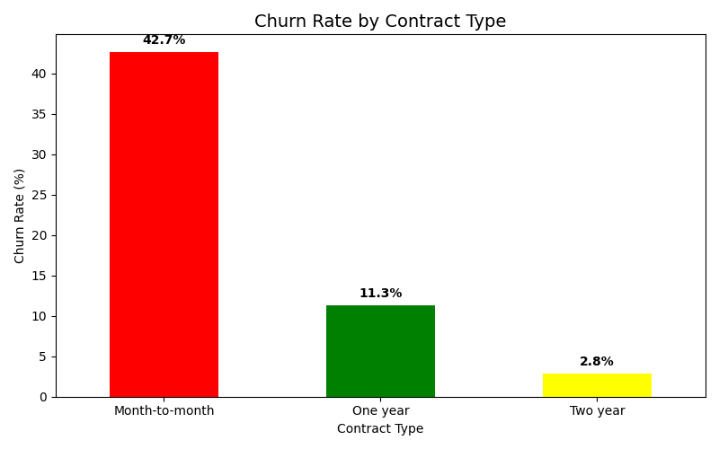
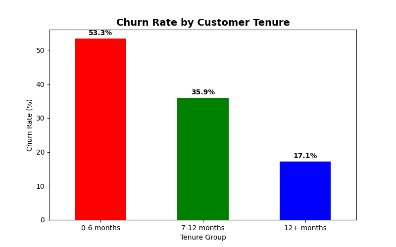
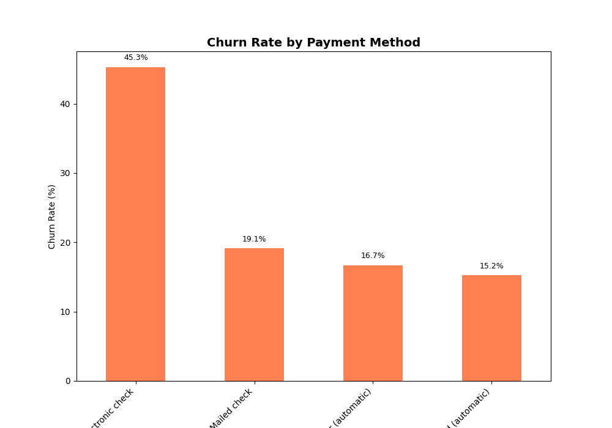

# 📊 Telecom Customer Churn Analysis

## 📌 Project Overview
This project analyzes customer churn for a telecom company. The goal is to identify **why customers are leaving** and provide **data-driven recommendations** to reduce churn.

## 🎯 Problem Statement
- **Current churn rate:** 26.54%
- **Customers lost:** 1,869 out of 7,043
- **Industry average:** 5-10%
- **Impact:** Revenue loss + high customer acquisition cost

## 📁 Dataset
- **Source:** IBM Telco Customer Churn Dataset (Kaggle)
- **Rows:** 7,043
- **Columns:** 21
- **Target variable:** Churn (Yes/No)

## 🔧 Tools Used
- Python (Pandas, Matplotlib)
- VS Code
- Google Docs (Final Report)

## 📈 Key Insights

| Insight | Finding |
|---------|---------|
| Contract Type | Monthly customers: **42.7% churn** (15x higher than 2-year) |
| Tenure | First 6 months: **53.3% churn** |
| Deadly Combo | Monthly + New customer: **55.2% churn** (1,413 customers) |
| Payment Method | Electronic check: **45.3% churn** |
| Senior Citizens | **41.7% churn** vs 23.6% non-senior |
| Tech Support | Without support: **41.6% churn** (with support: 15.2%) |
| Monthly Charges | High charges (60-90): **33.9% churn** |

## 💡 Recommendations

| # | Recommendation | Expected Impact |
|---|----------------|-----------------|
| 1 | Annual contract incentive (15% discount) | Reduce monthly churn 42.7% → 20% |
| 2 | First 90-day onboarding program | Reduce early churn 53.3% → 30% |
| 3 | Auto-pay discount (5%) | Reduce electronic check churn by 40% |
| 4 | Senior citizen care program | Reduce senior churn 41.7% → 25% |
| 5 | Free tech support for first 3 months | Reduce no-support churn by 50% |

## 📊 Visualizations

### Chart 1: Churn Rate by Contract Type

### Chart 2: Churn Rate by Tenure Group

### Chart 3: Churn Rate by Payment Method

## 📄 Final Report
[Download PDF Report](Customer_Churn_Analysis_Report.pdf)

## 🏆 Conclusion
With the 5 recommendations above, churn can be reduced from **26.54% to 15-18%** within 6 months.

## 👨‍💻 Author
**Waseeque Ahmad**  
Data Analyst | Python | SQL

## 📅 Date
11 May 2026
