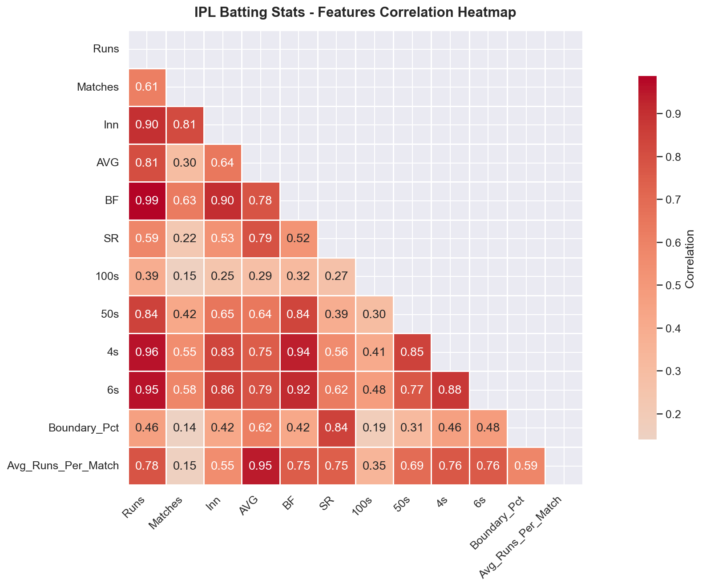
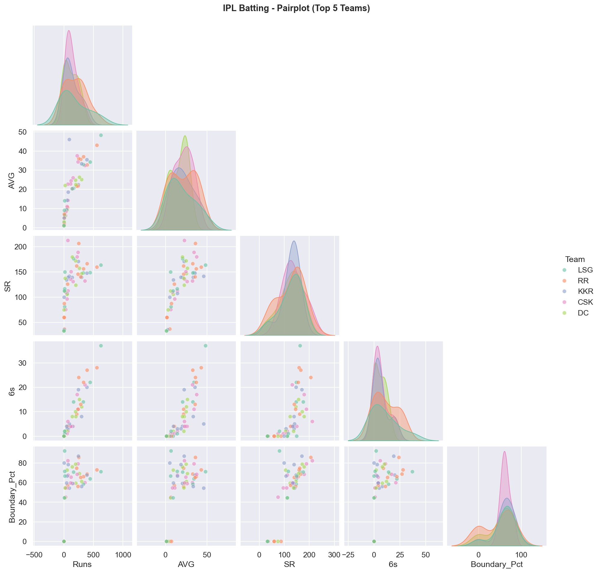
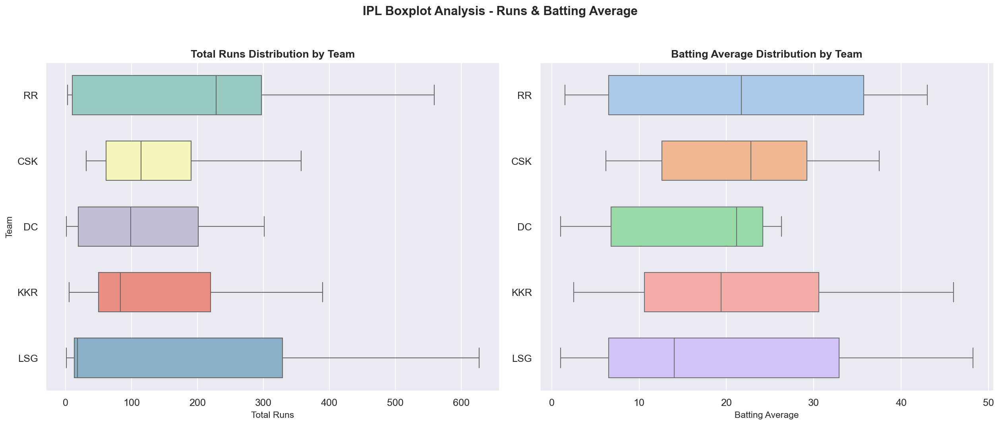
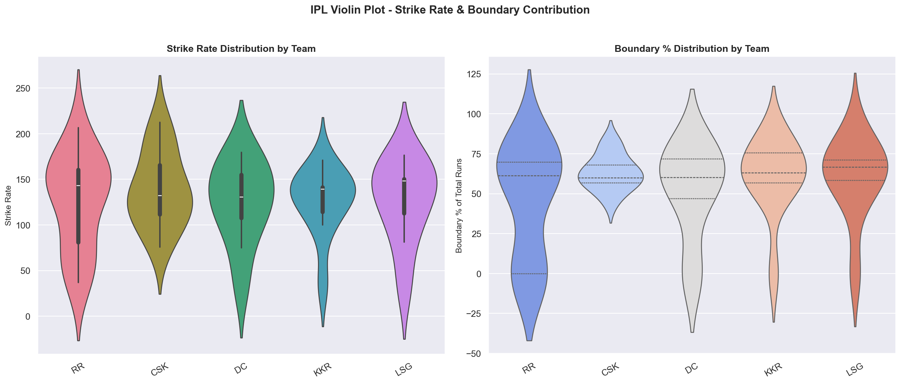
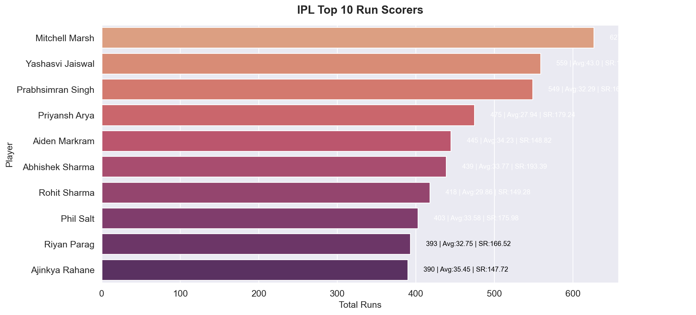

# 🏏 IPL Batting Stats — Exploratory Data Analysis (EDA)


> A complete EDA project on IPL batting statistics using Python & Seaborn.
> Part of my #100DaysOfCode journey.

---

## 📌 About the Project

This project performs Exploratory Data Analysis on **real IPL batting data** — 89 players across 10 teams.
The goal: find patterns in player performance using 5 different visualizations.

**Questions I tried to answer:**
- Which features are most correlated with run-scoring?
- Do aggressive batters (high SR) also score the most runs?
- Which teams have the most consistent batters?
- What % of runs come from boundaries?

---

## 📊 Dataset

| Info | Value |
|------|-------|
| Players Analyzed | 89 |
| Teams | 10 |
| Columns | 14 |

**Columns:**
```
Player Name, Team, Runs, Matches, Inn, No, HS, AVG, BF, SR, 100s, 50s, 4s, 6s
```

**Engineered Features:**
| Feature | Formula |
|---------|---------|
| `Boundary_Runs` | (4s × 4) + (6s × 6) |
| `Boundary_Pct` | Boundary_Runs / Runs × 100 |
| `Avg_Runs_Per_Match` | Runs / Matches |

---

## 📈 Charts & Key Findings

### 🔥 Chart 1 — Heatmap (Feature Correlation)


**Finding:** BF and Runs have **0.99 correlation** — almost perfect. 4s and Runs at 0.96 shows boundaries are the primary run source in T20.

---

### 🔵 Chart 2 — Pairplot (Top 5 Teams)


**Teams:** RR, CSK, KKR, DC, LSG
**Finding:** High SR is scattered vs Runs — confirms aggressive batting alone doesn't guarantee volume scoring.

---

### 📦 Chart 3 — Boxplot (Runs & Batting Average)


**Finding:** RR has the highest median runs. LSG has the widest spread (most inconsistency). DC is tight and consistent but lower volume.

---

### 🎻 Chart 4 — Violin Plot (Strike Rate & Boundary %)


**Finding:** RR has the widest Strike Rate distribution — a mix of explosive openers and careful lower-order. CSK's narrow violin = more uniform style.

---

### 🏆 Chart 5 — Top 10 Run Scorers


| Player | Runs | AVG | SR |
|--------|------|-----|----|
| Mitchell Marsh | 627 | 48.23 | ~162 |
| Yashasvi Jaiswal | 559 | 45.0 | — |
| Prabhsimran Singh | 549 | 32.29 | — |
| Abhishek Sharma | 439 | 43.77 | 193.39 |
| Rohit Sharma | 418 | 29.86 | 149.28 |

---

## 🔍 Key Insights

```
🏆 Top Run Scorer   : Mitchell Marsh  (627 runs)
⚡ Best Strike Rate : Urvil Patel     (SR: 212.5)
📈 Best Average     : Mitchell Marsh  (Avg: 48.23)
💥 Most Sixes       : Mitchell Marsh  (37 sixes)
📊 Overall Avg SR   : 130.00
📊 Overall Avg Bat  : 20.11
```

- **Mitchell Marsh** dominated — top in Runs, Average, AND Sixes all at once.
- **Highest SR ≠ Highest Runs.** Urvil Patel (SR 212.5) scored far fewer runs than Marsh.
- **Avg batting avg of 20.11** shows how brutal T20 cricket is for most players.

---

## 🛠️ Tech Stack

```
Python 3.10+  |  Pandas  |  NumPy  |  Seaborn  |  Matplotlib
```
⭐ **Star this repo if you found it helpful!**
Follow my [LinkedIn](www.linkedin.com/in/waseeque-ahmad-ba8691298) for more projects!
